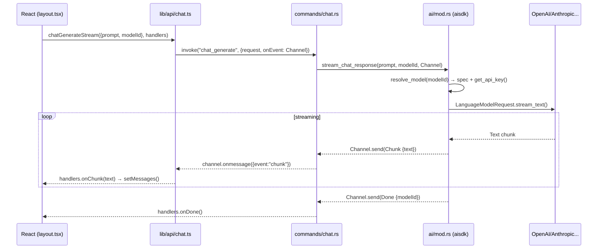

# 01 — Architecture Overview

## 1.1 ภาพรวมสถาปัตยกรรม

```
                    ┌─────────────────────────────────┐
                    │       Tauri Desktop App         │
                    │  ┌───────────────────────────┐  │
                    │  │      WebView (Frontend)   │  │
                    │  │  React / Vue / Svelte     │  │
                    │  │  src/pages/chat/layout.tsx│  │
                    │  └────────────┬──────────────┘  │
                    │               │ invoke + Channel│
                    │  ┌────────────▼──────────────┐  │
                    │  │    Rust Core Backend      │  │
                    │  │  src-tauri/src/lib.rs     │  │
                    │  │  ├─ commands/chat.rs      │  │
                    │  │  ├─ ai/mod.rs             │  │
                    │  │  └─ chat_stream.rs        │  │
                    │  └────────────┬──────────────┘  │
                    └───────────────┼─────────────────┘
                    ┌───────────────┼─────────────────┐
                    ▼               ▼                 ▼
             ┌────────────┐  ┌────────────┐  ┌────────────────┐
             │ 1. Local   │  │ 2. Provider│  │ 3. Local Port  │
             │ CLI/Agent  │  │   API      │  │   / Socket     │
             │ opencode   │  │ OpenAI etc │  │ Agent Server   │
             │ cursor CLI │  │ (HTTPS)    │  │ TCP/UDS/WS/HTTP│
             └────────────┘  └────────────┘  └────────────────┘
```

### ทำไมต้อง 3 ทาง?

| ทาง | ใช้เมื่อไหร่ | ตัวอย่าง |
|----|--------------|----------|
| **1. Local CLI / Agent** | ต้องการใช้ความสามารถของ Agent ที่มีอยู่แล้วบนเครื่อง (ไม่ต้องเขียน LLM client เอง) | `opencode run "fix bugs"`, `cursor-agent --print` |
| **2. Provider API** | ต้องการควบคุม prompt / model / cost เอง, streaming เสถียร, ไม่พึ่ง tool ภายนอก | เรียก `api.openai.com/v1/chat/completions` ผ่าน `aisdk` |
| **3. Local Port/Socket** | ต้องการให้ Tauri เป็น client ของ Agent Server ที่รันแยก process / รัน agent แบบ long-lived | Agent รัน `localhost:3000`, Tauri เชื่อมผ่าน `TcpStream` / `WebSocket` |

> ทั้ง 3 ทาง **ใช้ Channel เดียวกัน** (`ChatStreamEvent`) ส่งกลับไปหา React จึงสลับไปมาได้โดยไม่แก้ Frontend

## 1.2 โครงสร้างโปรเจกต์ปัจจุบัน

```
mali_cowork/
├── src/
│   ├── pages/chat/
│   │   ├── layout.tsx          # Orchestrator: ส่ง prompt → รับ stream
│   │   ├── components/
│   │   │   ├── prompt.tsx      # input + model selector
│   │   │   └── chat-messages.tsx
│   │   └── types.ts            # ChatMessage, ChatRole
│   ├── lib/api/chat.ts         # Tauri invoke wrapper + Channel
│   └── layouts/app-layout.tsx
├── src-tauri/
│   ├── Cargo.toml              # aisdk, serde, dotenvy, futures
│   ├── tauri.conf.json         # windows: decorations:false, 1280x720
│   └── src/
│       ├── lib.rs              # run(): dotenvy + tauri::Builder
│       ├── ai/mod.rs           # resolve_model() + stream_chat_response()
│       ├── chat_stream.rs      # enum ChatStreamEvent {Started,Chunk,Done,Error}
│       └── commands/chat.rs    # #[tauri::command] chat_generate
├── .env / .env.example
└── docs/                       # ← เอกสารชุดนี้
```

## 1.3 Data Flow (Provider API — ทางที่ทำเสร็จแล้ว)



### จุดสำคัญของการออกแบบ

1. **Single error contract** — `ai/mod.rs:225` ส่ง `Error` ผ่าน Channel แล้ว `return Ok(())` ไม่ `Err` เพื่อกัน UI ได้รับ error ซ้ำ 2 ครั้ง (channel + invoke throw)
2. **Streaming ไม่บล็อก UI** — `Channel` เป็น async, React ใช้ `onChunk` ต่อ string ทีละชิ้น
3. **Model registry** — `resolve_model()` ที่ `ai/mod.rs:15` เป็นจุดเดียวที่ map `modelId` (ที่ UI ส่งมา) → `api_model` + `provider`
4. **Env trimming** — `get_api_key()` ตัด `"` `'` และ whitespace อัตโนมัติ (`ai/mod.rs:79`)

## 1.4 เปรียบเทียบ 3 ทางแบบละเอียด

| มิติ | 1. CLI/Agent | 2. Provider API | 3. Port/Socket |
|------|--------------|-----------------|----------------|
| Dependency | ต้องติดตั้ง CLI บนเครื่อง | ต้องมี API Key | ต้องรัน server แยก |
| Streaming | อ่านจาก stdout (line-buffered) | SDK stream (SSE) | TCP/WS frame |
| Latency | สูง (spawn process) | ต่ำ | ต่ำ-กลาง |
| Offline | ได้ถ้า model local | ไม่ได้ | ได้ถ้า server local |
| ความซับซ้อน Rust | `std::process::Command` | `aisdk` crate | `tokio` + `axum` / `tungstenite` |
| เหมาะกับ | ใช้ agent สำเร็จรูป | ควบคุม LLM เอง | ประสานหลาย agent |

## 1.5 เมื่อไหร่ควรใช้ทางไหนร่วมกัน?

- **CLI + API**: ให้ CLI ทำ tool-use / file-edit, ส่วน API ทำ chat ธรรมดา → แยก `modelId` prefix เช่น `cli:opencode` vs `openrouter/...`
- **Socket + API**: Agent Server ทำ planning ยาวๆ, Tauri ทำ chat สั้นๆ ยิงตรง Provider เพื่อลด hop
- **ทั้ง 3 ทาง**: ใช้ `enum BackendKind { Cli, Api, Socket }` ใน `ChatRequest` แล้วให้ Rust `match` เลือก backend

> ดูวิธี implement แต่ละทางใน `03` / `04` / `05` ต่อไป
