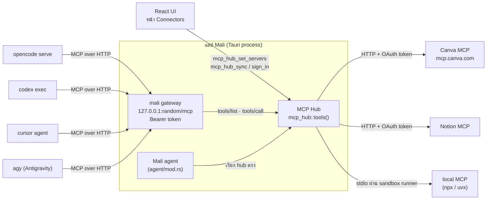
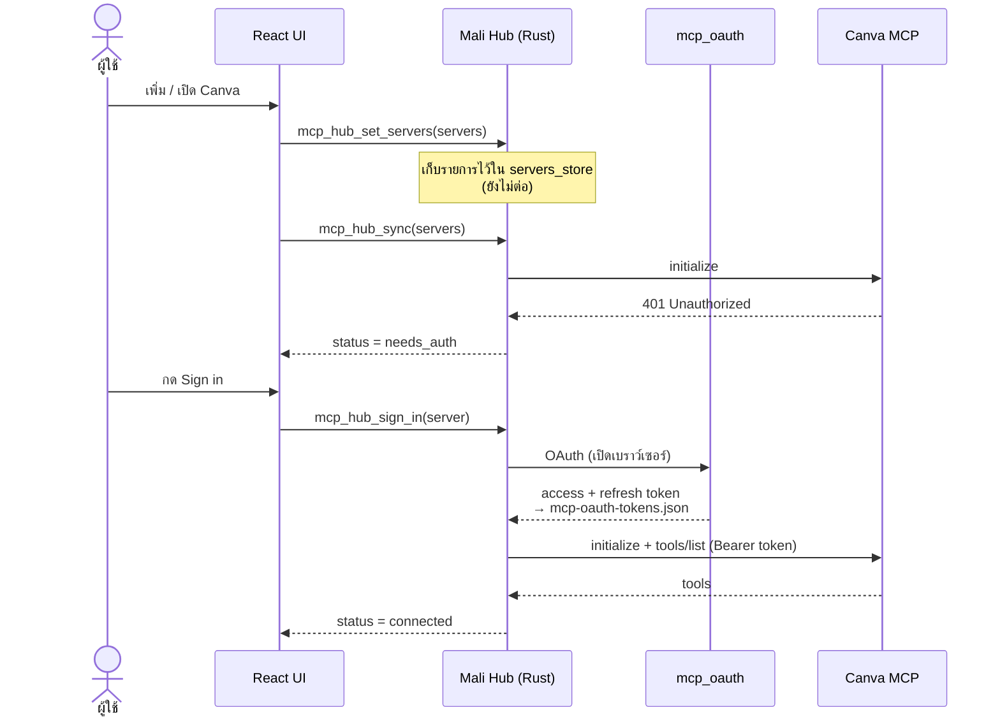
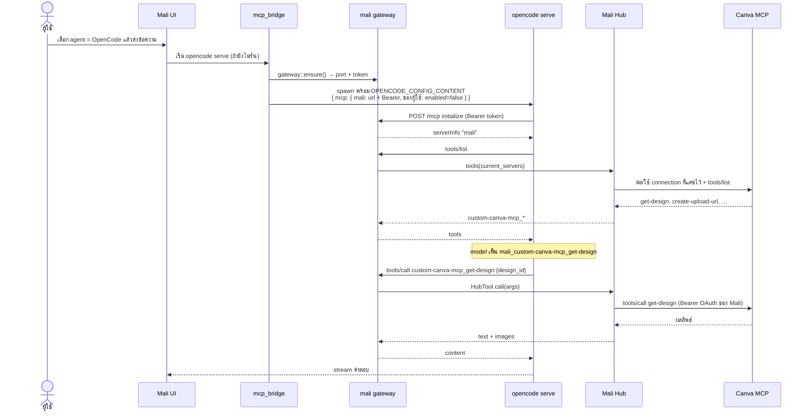
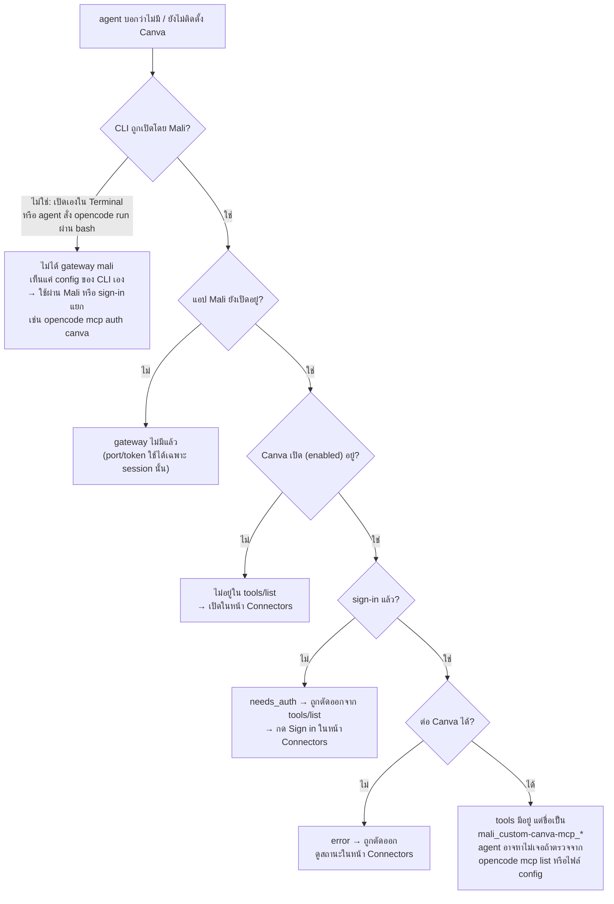

# 07 — MCP Hub & `mali` Gateway (OpenCode / Codex / Cursor / Antigravity)

> บทนี้อธิบายว่า connector (MCP) ที่ติดตั้งในแอป Mali เช่น Canva, Notion ไปถึง agent ตัวอื่น — OpenCode, Codex, Cursor, Antigravity — ได้อย่างไร และทำไมบางครั้ง agent พวกนั้น "มองไม่เห็น" connector

## 7.1 หลักการ

- **Mali เป็นคนเดียวที่ต่อ connector จริง** — local server รันผ่าน sandbox runner, remote server ใช้ sign-in (OAuth) ของ Mali เอง token อยู่ใน `~/Library/Application Support/mali-cowork/mcp-oauth-tokens.json`
- **agent อื่นไม่ได้ต่อ Canva ตรง** — มันต่อกับ MCP server ตัวเดียวชื่อ **`mali`** (gateway) แล้ว gateway ส่งต่อทุก call ให้ hub
- **ไม่เขียน connector ลง config ของแอปอื่น** — gateway ถูกส่งให้ CLI เฉพาะ run ที่ Mali เปิดเอง และ entry ที่ Mali เคยเขียนไว้สมัยก่อนจะถูกลบออก (`mcp_release_other_apps`)

| ส่วน | ไฟล์ | หน้าที่ |
|------|------|---------|
| Hub | `src-tauri/src/mcp_hub/mod.rs` | เก็บรายการ connector, ต่อ/แคช connection, รวม tools |
| MCP client | `src-tauri/src/mcp_hub/client.rs` | คุย MCP กับ server จริง (stdio / HTTP) แนบ OAuth token |
| Gateway | `src-tauri/src/mcp_hub/gateway.rs` | MCP server `mali` บน `127.0.0.1:<port>/mcp` |
| Bridge | `src-tauri/src/commands/mcp_bridge.rs` | ส่ง gateway ให้ OpenCode / Codex / Cursor / Antigravity |
| Tauri commands | `src-tauri/src/commands/mcp_hub.rs` | `mcp_hub_set_servers`, `mcp_hub_sync`, `mcp_hub_sign_in`, `mcp_hub_set_workspace` |
| Frontend | `src/features/mcp/api.ts` | `syncMcpServers()` ส่งรายการ connector ให้ hub |

## 7.2 ภาพรวม



## 7.3 Gateway `mali`

- เริ่มครั้งแรกที่มี CLI ต้องใช้ (`gateway::ensure()`) แล้วอยู่จนปิดแอป
- ฟังแค่ **loopback** บน **พอร์ตสุ่ม** พร้อม **token สุ่ม** — ทั้งสองค่าเปลี่ยนทุกครั้งที่เปิด Mali
- ตรวจทุก request: path ต้องเป็น `/mcp`, header `Host` ต้องเป็น loopback + พอร์ตนี้ (กันเว็บเพจยิงเข้ามา), `Authorization: Bearer <token>` ต้องตรง
- รองรับ JSON-RPC: `initialize`, `ping`, `tools/list`, `tools/call`, `resources/list` / `prompts/list` (ว่าง)
- `tools/list` = tools ของทุก connector ที่ **เปิดอยู่และต่อได้** + tools เอกสารของ Mali (templates / .docx)
- `tools/call` หา tool ตามชื่อแล้วให้ hub เรียก server จริง ภาพที่ได้ส่งกลับเป็น MCP image content

**ชื่อ tool** — hub ตั้งชื่อเป็น `<connectorId>_<tool>` (ยาวไม่เกิน 64 ตัว) แล้ว CLI เติมชื่อ server ข้างหน้าอีกชั้น เช่น Canva:

| ที่ไหน | ชื่อที่เห็น |
|--------|-----------|
| Mali agent | `custom-canva-mcp_get-design` |
| OpenCode / Codex | `mali_custom-canva-mcp_get-design` |
| Cursor | อยู่ใต้ server `plugin-mali-cowork-mali` |

## 7.4 แต่ละ CLI ได้ gateway อย่างไร

| CLI | วิธีส่ง `mali` | connector ของผู้ใช้เองใน CLI นั้น |
|-----|---------------|-------------------------------|
| **OpenCode** | env `OPENCODE_CONFIG_CONTENT` ตอน Mali สั่ง `opencode serve` (`opencode/server.rs`) | ถูก **ปิด** (`enabled: false`) ระหว่างรันใน Mali |
| **Codex** | `-c mcp_servers.mali.url=…` + `bearer_token_env_var = MALI_MCP_TOKEN` ต่อ run | ถูกปิดด้วย `-c mcp_servers.<id>.enabled=false` |
| **Cursor** | plugin ชั่วคราว `--plugin-dir …/mali-cowork/cursor/mali-cowork` ที่มี `mcp.json` ชี้ gateway | ยังโหลด `~/.cursor/mcp.json` ตามปกติ (Cursor ไม่มีวิธีปิดต่อ run) |
| **Antigravity** | "lease": เขียน `mali` ลง `~/.gemini/config/mcp_config.json` + allow-rule `mcp(mali/*)` ขณะมี run อยู่ แล้วลบออกเมื่อ run สุดท้ายจบ | ไม่แตะ entry ที่ผู้ใช้เขียนเอง |

ก่อนเริ่ม run ใน Cowork mode frontend จะเรียก `mcp_hub_set_workspace` (`src/pages/chat/turn.ts`) เพื่อบอก gateway ว่า tools เอกสารใช้โฟลเดอร์ไหนได้

## 7.5 Flow: ตั้งค่า connector (เช่น Canva)



## 7.6 Flow: OpenCode เรียก Canva ผ่าน Mali



Codex, Cursor และ Antigravity ใช้ flow เดียวกัน ต่างกันแค่ขั้น "ส่ง gateway ให้ CLI" ตามตาราง 7.4

## 7.7 Flow: ทำไมบางครั้ง agent "มองไม่เห็น" Canva



**ข้อควรรู้**

- `opencode mcp list` หรือ `~/.config/opencode/opencode.json` จะ **ไม่มี** Canva ของ Mali — มีแค่ `mali` (และ entry ของผู้ใช้เองที่ถูกปิดระหว่างรันใน Mali)
- token ของ Mali (`custom-canva-mcp`) ใช้ร่วมกับ CLI อื่นไม่ได้ ถ้าจะใช้ CLI นอก Mali ต้อง sign-in ใน CLI นั้นเอง
- gateway ประกาศ `listChanged: false` — ไม่แจ้ง CLI เมื่อรายการ connector เปลี่ยน ถ้าตอน CLI เริ่ม `tools/list` ล้มเหลว (เช่น timeout) CLI อาจไม่ลองใหม่จนกว่าจะเริ่มใหม่ (OpenCode: `opencode::server::restart()`)
- Mali agent ของแอปเองไม่ผ่าน gateway — เรียก `mcp_hub::tools()` ตรง และได้รายการ connector ที่ต่อไม่ได้ไปใส่ใน system prompt (`connectors_note`) ด้วย

## 7.8 ตรวจสอบด้วยมือ

```bash
# ดูว่าจะเกิดอะไรกับ CLI: รายการที่ Mali ติดตามไว้ในไฟล์ของแอปอื่น
cat ~/Library/Application\ Support/mali-cowork/mcp-clients.json

# connector ไหน sign-in กับ Mali แล้ว (ดูแค่ชื่อ ไม่พิมพ์ token)
python3 -c "import json;print(list(json.load(open('$HOME/Library/Application Support/mali-cowork/mcp-oauth-tokens.json'))))"

# log ของ OpenCode (หา mali / mcp)
grep -h -i "mcp" ~/.local/share/opencode/log/*.log | tail
```
